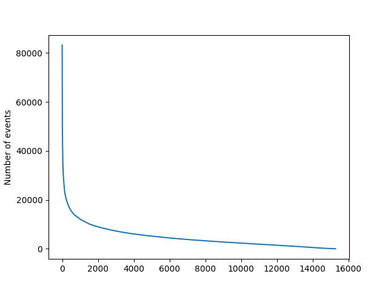

# Video Game Music Neural Network

Personal project using Tensorflow in Python to create a neural network that tries to generate music based on music from old consoles.

## The data

### Scraper

A scraper was used to get midi files of console music from https://www.vgmusic.com/  
The NES, SNES, Gameboy, TurboGrafx-16 and Sega Genesis were targeted.

### Encoding

To let the network read the data, it needs to be decoded from its midi formated and encoded in a digestible format.  
The encoding format is inspired by OpenAI's MuseNet (Payne, Christine. "MuseNet." OpenAI, 25 Apr. 2019, openai.com/blog/musenet)    
This format is a string, which contains all events in the song and is then tokenized into a list which is then saved into a TFRecord file for easy reading.  

The string is enclosed between "start" and "end"  
Notes played are represented as words of this form `i{instrument}:v{velocity}:{note pitch}`  
Notes that finish playing will have the same form as above but start with "end:"  
Waiting times have the form `wait:{wait amount}`  
Tempo changes have the form `tempo:{tempo}`  

Example:  
```start tempo150 i99:v100:64 wait:8 i99:v110:46 wait:4 end:i99:v100:64 [...] finish```


### Limiting

Here is a graph showing how many songs have a certain amount of events



As we can see, about 2000 songs have over 10000 events. This represents a little under 15% of the songs and since padding is used for tokenizing, by removing those songs, we can increase the network's efficiency.  

Some songs also have very long wait times. The maximum amount of wait accepted is 128 beats and songs that have a longer wait time are not used.


## The architecture

The architecture uses a Transformer, heavily inspired by https://www.tensorflow.org/tutorials/text/transformer  
A LSTM was considered, but because of the issues with parallelization and long range dependencies, a Transformer was preferred.


## Results

When tested on a single song, the first thing it learned was that if it used the most frequent word at all times, it would quickly increase its accuracy. It then learned the pattern and was able to recreate the song.  
When tested on the whole dataset, it quickly became obvious that with the speed it was going through the epochs, it would finish the first epoch in a much too long time. A limit to the number of songs parsed and multiple cuts to the context managed to reduce the time, but it was sadly still much too long of a process. After 100 epochs, or about 10 days, similar to the single song test, it learned to use the most frequent word and sometimes uses other frequent words, but hasn't learned anything that makes sense to humans yet. The accuracy slowly increased from 0.1087 to 0.1240 and the loss decreased from 9.4233 to 3.3184. While the changes are slow, they haven't plateaued either, meaning there is still more to learn.


## Future Work

Many ameliorations can be done in the future on both the architecture and data.  
Following OpenAI's lead and changing the Transformer to a Sparse Transformer would be an interesting step.
For the data, lowering the dictionnary size even more would be the next step. This can be done by aggregating similar instruments. Another technique could be to find the keys that are used less often and change the notes in those songs to another key.  
Once these are done, increasing the context and letting the code run until a plateau is reached should give more interesting results.